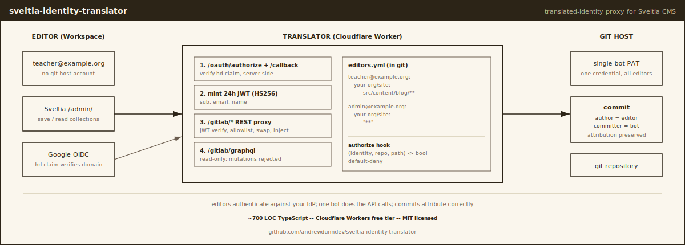

# sveltia-identity-translator

[](LICENSE)


A translated-identity proxy for [Sveltia CMS][sveltia]. Editors authenticate
against your existing identity provider (Google Workspace, etc.); a single
service-account [Personal Access Token][gl-pat] (PAT) holds the only
credential that ever touches GitLab; commits attribute correctly to the
editor via git's [author/committer split][git-author-committer]. Editors
save changes without ever creating a GitLab account, learning git, or
understanding what a commit is.

Runs as a [Cloudflare Worker][cf-workers] on the free tier.

[sveltia]: https://sveltiacms.app/
[gl-pat]: https://docs.gitlab.com/user/profile/personal_access_tokens/
[git-author-committer]: https://git-scm.com/book/en/v2/Git-Tools-Signing-Your-Work
[cf-workers]: https://developers.cloudflare.com/workers/

## Who this is for

You're a small org (school, nonprofit, club, side project) that:

- Wants a [git-backed CMS][headless-cms] (Sveltia, Decap) for the version
  control / portability / no-vendor-lock benefits.
- Has a handful of non-technical editors (teachers, volunteers, staff)
  who already live in Google Workspace, Microsoft 365, or similar.
- Doesn't want to give them all GitLab/GitHub accounts (cost, friction,
  password management, ongoing user-management overhead).
- Doesn't want to pay for a hosted CMS like Sanity or Contentful (cost,
  lock-in).
- Wants legible code that the next volunteer can maintain.

If your editors already have GitLab accounts, you don't need this. Use
the standard [`sveltia-cms-auth`][sveltia-auth] proxy. This translator is
specifically for the case where the editor identity and the git-host
identity are not the same person.

[headless-cms]: https://en.wikipedia.org/wiki/Headless_content_management_system
[sveltia-auth]: https://github.com/sveltia/sveltia-cms-auth

## What it does


The translator does five jobs:

1. **OAuth handshake.** Standard authorization-code flow against your
   IdP. The crucial check is server-side verification of the [`hd`
   claim][hd-claim] on the userinfo response, not the `hd` URL hint at
   authorize time. The hint scopes the account chooser; only the
   server-side check enforces.

2. **JWT mint.** A 24-hour [HS256][jwt-hs256] token signed with a server
   secret. Carries `sub`, `email`, `name`, enough for everything
   downstream.

3. **REST proxy.** Every API call from Sveltia goes through `/gitlab/*`.
   The Worker validates the JWT, consults `editors.yml`, swaps the
   editor's JWT for the GitLab service-account PAT, and forwards. On
   commit POSTs, it injects `author_name` and `author_email` into the
   request body so the editor's identity survives onto the commit.

4. **GraphQL passthrough, read-only.** Sveltia uses GraphQL for all
   reads (file tree, blobs, default branch) and REST for writes. The
   upstream comment in `commits.js` explains: *"the commitCreate
   GraphQL mutation is broken and images cannot be uploaded properly,
   so we use the REST API instead."* The translator forwards GraphQL
   queries verbatim and [fails closed][fail-closed] on any body
   containing a `mutation` keyword (HTTP 403).

5. **Synthesized identity endpoints.** Two GitLab API endpoints aren't
   forwarded; the translator answers them from the JWT directly. `GET /user` returns the
   editor's identity (the PAT's userinfo would be the bot, which is
   wrong). `GET /projects/<repo>/members/all/0` returns a fake
   Maintainer membership (Sveltia checks repo access by user-id after
   fetching `/user`; with our synthesized `id: 0`, the upstream call
   404s). These aren't optional features; they're mechanical
   requirements of the model.

[hd-claim]: https://developers.google.com/identity/openid-connect/openid-connect#hd-param
[jwt-hs256]: https://en.wikipedia.org/wiki/JSON_Web_Token
[fail-closed]: https://en.wikipedia.org/wiki/Fail-safe#Fail-secure

Authorization is a pluggable hook: `authorize(identity, repo, method,
path) → bool`. The default impl is a YAML allowlist (`editors.yml`)
checked into the repo with per-(email, repo, path-glob) tuples;
default-deny. The hook shape is what matters; the YAML is one
implementation. See [ARCHITECTURE.md](./ARCHITECTURE.md) for the
load-bearing design decisions.

## End-to-end setup

What you'll need:

- A Google Workspace tenant (or other OIDC IdP with a hosted-domain
  claim).
- A GitLab.com group containing the repo(s) Sveltia edits.
- A Cloudflare account on the [Workers free plan][cf-pricing] (no
  custom domain required to start).
- A site already running Sveltia. If you don't have one yet, see the
  [Sveltia quickstart][sveltia-quickstart].

[cf-pricing]: https://developers.cloudflare.com/workers/platform/pricing/
[sveltia-quickstart]: https://github.com/sveltia/sveltia-cms#quick-start

Estimated time, first deployment: 30–45 minutes. Subsequent deploys
are `wrangler deploy`.

The four steps below have full detail in `docs/`:

1. **GitLab service account + PAT**, see
   [docs/gitlab-pat-setup.md](./docs/gitlab-pat-setup.md).
2. **Google OAuth client**, see
   [docs/google-oauth-setup.md](./docs/google-oauth-setup.md).
3. **Cloudflare Worker deploy**, see
   [docs/cloudflare-deploy.md](./docs/cloudflare-deploy.md).
4. **Sveltia config wiring**, see
   [docs/sveltia-config.md](./docs/sveltia-config.md).

Below is the condensed walkthrough. If anything feels unclear, the
linked per-step docs go deeper.

### 1. GitLab: create the service account and PAT

The service account is a regular GitLab user with a name like
`<org>-cms-bot`. It must be a member of the group whose repos Sveltia
will edit, with **Maintainer** role (Developer can't push to protected
branches; Maintainer can).

You need a [group access token][gl-group-token] (or personal access
token) with scope `api`. Set the expiry to 12 months and put a calendar
reminder to rotate. Save the token value securely; you'll need it in
step 3.

[gl-group-token]: https://docs.gitlab.com/user/group/settings/group_access_tokens/

### 2. Google: create the OAuth client

In the [Google Cloud Console][gcp-console]:

1. Create a project (or reuse one).
2. Configure the [OAuth consent screen][gcp-consent]: User type
   "Internal" if your Workspace allows it (only your org's users can
   sign in); set the app name, support email, and authorized domains
   to include both your Workspace primary domain and the hostname the
   Worker will eventually run on.
3. Create credentials → OAuth client ID → "Web application." Add
   `https://<worker-hostname>/oauth/callback` as an Authorized
   redirect URI. For local development, also add
   `http://localhost:8787/oauth/callback`.
4. Save the Client ID and Client Secret. You'll need them in step 3.

[gcp-console]: https://console.cloud.google.com/
[gcp-consent]: https://console.cloud.google.com/apis/credentials/consent

### 3. Cloudflare: deploy the Worker

```bash
git clone https://github.com/andrewdunndev/sveltia-identity-translator.git
cd sveltia-identity-translator
npm install

# Create your config files from the templates.
cp wrangler.toml.example wrangler.toml
cp editors.yml.example editors.yml

# Edit wrangler.toml: set ALLOWED_DOMAIN to your Workspace primary
# domain (e.g. example.org). Optionally set a [[routes]] block to
# bind the Worker to a custom hostname.
$EDITOR wrangler.toml

# Edit editors.yml: list each editor (by their Workspace email) and
# the repos + path globs they can write to. See the file's comments
# for the schema. Default deny: empty file = nobody can write
# anything.
$EDITOR editors.yml

# Deploy. wrangler will prompt you to log in to Cloudflare.
npx wrangler deploy

# Set the four secrets. wrangler will prompt for each.
npx wrangler secret put OAUTH_CLIENT_ID         # from step 2
npx wrangler secret put OAUTH_CLIENT_SECRET     # from step 2
npx wrangler secret put GITLAB_API_TOKEN        # from step 1
npx wrangler secret put JWT_SECRET              # generate one: `openssl rand -hex 32`

# Verify. Should print "translator ok".
curl https://<worker-hostname>/healthz
```

The Worker's hostname is either `<name>.<account>.workers.dev` (free,
auto-provisioned) or whatever custom hostname you configured via
`[[routes]]`.

### 4. Sveltia: point at the translator

In your site's Sveltia `admin/config.yml`:

```yaml
backend:
  name: gitlab
  repo: your-org/your-site
  branch: main
  api_root: https://<worker-hostname>/gitlab
  auth_endpoint: oauth/authorize
  base_url: https://<worker-hostname>
  proxied: true
```

Open `https://your-site.example.org/admin/`. Sveltia should redirect
you through the Google consent screen and back. After sign-in,
collections from your repo should populate. Make a test edit, click
Save, and check `git log`, the commit should be authored by your
email, committer should be the bot.

If anything fails, see the per-step docs for the most common gotchas
and the smoke harness below to isolate where the contract is breaking.

## editors.yml: the allowlist

Default-deny. An identity with no entry can't read or write anything
through the translator, even if their JWT is valid.

```yaml
admin@example.org:
  your-org/your-site:
    - "**"

editor@example.org:
  your-org/your-site:
    - "src/content/blog/**"
```

Read access is repo-membership: any path glob entry under a repo
grants read. Write access is per-glob match. Globs use standard
syntax (`*`, `**`, `?`); other regex metacharacters are escaped. See
`editors.yml.example` for the full schema and operational notes.

The allowlist is checked into the same repo as the Worker. Versioning
it in git gives you blame, review, and rollback for free. CI lints
the YAML on every push; a parse error would otherwise brick the
editor flow on deploy.

If you want allowlist data to live elsewhere (a database, an LDAP
query, an external policy engine), implement the `Authorizer`
interface in `src/authorize.ts` and wire it into `src/index.ts`.
The hook signature is `(ctx: AuthorizeContext) => boolean`; the
proxy doesn't care where the answer comes from.

## Local dev

```bash
# Populate .dev.vars with the same secrets you set in production.
# This file is gitignored.
cat > .dev.vars <<EOF
OAUTH_CLIENT_ID=<your client id>
OAUTH_CLIENT_SECRET=<your client secret>
GITLAB_API_TOKEN=<your group/personal token>
JWT_SECRET=<openssl rand -hex 32>
EOF

# Run the Worker locally on http://localhost:8787.
npm run dev
```

Visit `http://localhost:8787/healthz` to confirm. For the OAuth
round-trip, your Google OAuth client must include
`http://localhost:8787/oauth/callback` as an authorized redirect URI
(see step 2).

## Smoke harness

The repo ships a smoke test that hits every contract Sveltia depends
on by hand-minting JWTs against the Worker's secret:

```bash
# Against a local dev Worker.
JWT_SECRET=<the-same-secret> node scripts/smoke.mjs

# Against the deployed Worker.
JWT_SECRET=<the-same-secret> node scripts/smoke.mjs \
  --base-url https://<worker-hostname> \
  --repo your-org/your-site
```

The harness covers OAuth redirect, JWT validation, REST routing,
GraphQL routing + mutation rejection, allowlist enforcement (read +
write, positive + negative), CORS preflight, synthesized identity
endpoints, author injection, and PAT-expiry early warning. The actual
Google round-trip is exercised separately in a browser, headless
OAuth is brittle and the gain over local-mint coverage is small.

A pass run looks like:

```
sveltia-identity-translator smoke -- http://localhost:8787
  pass     GET /healthz returns 200 ok
  pass     GET /oauth/authorize redirects 302 to IdP consent
  pass     GET /gitlab/user with valid admin JWT -> 200, email matches
  ...
pass=18  blocked=0  fail=0
```

`blocked` cases are environment problems the translator can't fix
(branch protection refusing the bot, expired PAT), the proxy is
working; resolve outside the proxy.

## Architecture

The non-obvious design decisions are written up in
[ARCHITECTURE.md](./ARCHITECTURE.md). Highlights:

- Why GraphQL is read-only and not just rate-limited.
- Why `hd` is checked twice (the URL hint vs the userinfo claim).
- Why one Worker can serve multiple sites.
- Why JWT is 24h with no refresh token.
- Why `editors.yml` lives in the relay's repo.
- Why the smoke harness mints JWTs locally.

If you read one supplementary file beyond this README, make it that
one.

## Contributing

PRs welcome. See [CONTRIBUTING.md](./CONTRIBUTING.md) for the
contribution shape and the upstream conversation at
[`sveltia/sveltia-cms-auth`](https://github.com/sveltia/sveltia-cms-auth).
The translated-identity pattern is plausibly upstream-shaped; this
repo is the staging ground for that contribution.

## Prior art

- [`sveltia/sveltia-cms-auth`][sveltia-auth], Sveltia's standard
  OAuth proxy. Implements the strict 1:1 model (editor's own GitLab
  token is what reaches the CMS). No translation hook. This
  translator is what you'd write if you wanted that hook.
- [`vencax/netlify-cms-github-oauth-provider`][vencax], Decap's
  community OAuth provider, same shape, same limitation.
- [`decaporg/decap-cms`][decap], the CMS this pattern would also
  apply to. The Decap version of this translator is plausible but
  unimplemented; if you build it, send a PR.

[vencax]: https://github.com/vencax/netlify-cms-github-oauth-provider
[decap]: https://github.com/decaporg/decap-cms

## License

[MIT](./LICENSE).

---

Built by [Andrew Dunn](https://andrew.dunn.dev), with collaboration from [Andrew DeJong](https://dejong.engineering/) ([@adejong5](https://github.com/adejong5)), for the school he volunteers at. Distilled into a generic pattern other small orgs can deploy. The companion writeup is at [andrew.dunn.dev/writing/enabling-editors-to-use-git-without-knowing](https://andrew.dunn.dev/writing/enabling-editors-to-use-git-without-knowing/).
